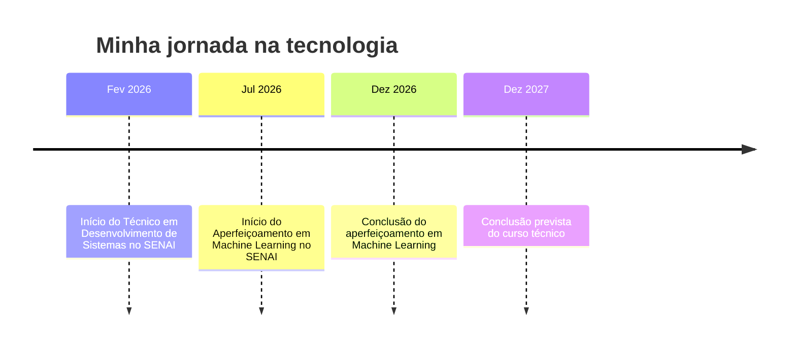

<!-- ===== CABEÇALHO ===== -->

  

  

  
  
  

  
  
  
  

---

## ⚡ Resumo rápido para recrutadores

| | |
|---|---|
| 👤 **Perfil** | Desenvolvedor de Sistemas em formação, Full-Stack, com foco em Front-End |
| 🎓 **Formação** | Técnico em Desenvolvimento de Sistemas, SENAI (Fev/2026 – Dez/2027) |
| 🤖 **Aperfeiçoamento** | Machine Learning, SENAI (Jul/2026 – Dez/2026) |
| 💻 **Stack** | HTML5 · CSS3 · JavaScript · SQL · C++ · Arduino · Git/GitHub |
| 🎯 **Busco** | Estágio ou vaga júnior em desenvolvimento de software |
| 📍 **Local** | Botucatu, SP |
| 🌎 **Idiomas** | Português (nativo) · Inglês (básico) |
| 📫 **Contato** | leonardoleaosantos2009@gmail.com |

---

## 👨‍💻 Sobre mim

Sou **Desenvolvedor de Sistemas em formação**, com foco em **Front-End** e conhecimentos em **HTML, CSS e JavaScript**. Tenho experiência prática na criação de interfaces web, lógica de programação e fundamentos de Back-End, além de conhecimentos em **banco de dados (SQL)**, **hardware** e **Machine Learning**.

Gosto de aprender fazendo: cada projeto aqui nasceu de um conceito que estudei e quis colocar em prática. Busco uma oportunidade para **aplicar meus conhecimentos, desenvolver projetos reais e evoluir profissionalmente** na área de tecnologia.

---

## 🛠️ Tecnologias

  

  
  
  
  
  
  
  
  

| Área | Conhecimentos |
|---|---|
| 🌐 **Desenvolvimento Web** | HTML5, CSS3, JavaScript |
| 🎨 **Front-End** | Interfaces web, responsividade, estilização com CSS |
| 🧠 **Programação** | Lógica de programação, funções, arrays, estruturas de controle |
| 🗄️ **Banco de Dados** | SQL (DDL/DML), modelagem de dados, DER |
| ⚙️ **Back-End** | Conceitos fundamentais |
| 🔌 **Eletrônica** | Arduino UNO, sensores, C++ |
| 🤖 **Machine Learning** | Fundamentos (em aprendizado) |
| 🧰 **Ferramentas** | Git, GitHub, Pacote Office, hardware e configuração |

---

## 🚀 Projetos

<table>
  <tr>
    <td width="50%" valign="top">
      <h3>🗄️ <a href="https://github.com/leonardoleaosantos2009-hub/DDL-DML-">Modelagem de Banco de Dados</a></h3>
      
Criação de modelos relacionais e DER, com entidades, atributos, chaves primárias e estrangeiras, usando comandos DDL e DML.

      
  

    </td>
    <td width="50%" valign="top">
      <h3>🅿️ <a href="https://github.com/leonardoleaosantos2009-hub/Sensor-de-Estacionamento-Ultrassonico-com-Arduino">Sensor de Estacionamento</a></h3>
      
Sensor ultrassônico com Arduino UNO que mede a distância de obstáculos, programado em C++.

      
 

    </td>
  </tr>
  <tr>
    <td width="50%" valign="top">
      <h3>🛒 Página de Vendas para Curso</h3>
      
Página web com seções, cards, botões e elementos de apresentação, desenvolvida com HTML e CSS.

      
 

    </td>
    <td width="50%" valign="top">
      <h3>🖼️ Galeria de Projetos Web</h3>
      
Interface de galeria com foco em organização e estilização de elementos.

      
 

    </td>
  </tr>
</table>

<!-- Quando subir os repositórios da Página de Vendas e da Galeria, transforme os títulos em links:
     <h3>🛒 <a href="https://github.com/leonardoleaosantos2009-hub/NOME-DO-REPO">Página de Vendas para Curso</a></h3> -->

---

## 🧭 Trajetória

---

## 🎯 Em que estou focado agora

- 🌱 Aprofundar **JavaScript** e **Back-End**
- 🗄️ Evoluir em **SQL** e modelagem de dados
- 🤖 Concluir o aperfeiçoamento em **Machine Learning**
- 🚀 Publicar novos projetos de **Front-End** e integrar com Back-End
- 🇺🇸 Melhorar o **inglês técnico**

---

## 📊 Atividade no GitHub

  

  
  

📈 Ver gráfico de atividade

 

  

---

## 🤝 Vamos conversar?

Estou aberto a **estágios, vagas júnior e projetos colaborativos**. Se o meu perfil combina com a sua empresa, será um prazer conversar.

  
  <!-- Se tiver LinkedIn, descomente e ajuste o link:
   -->

  

